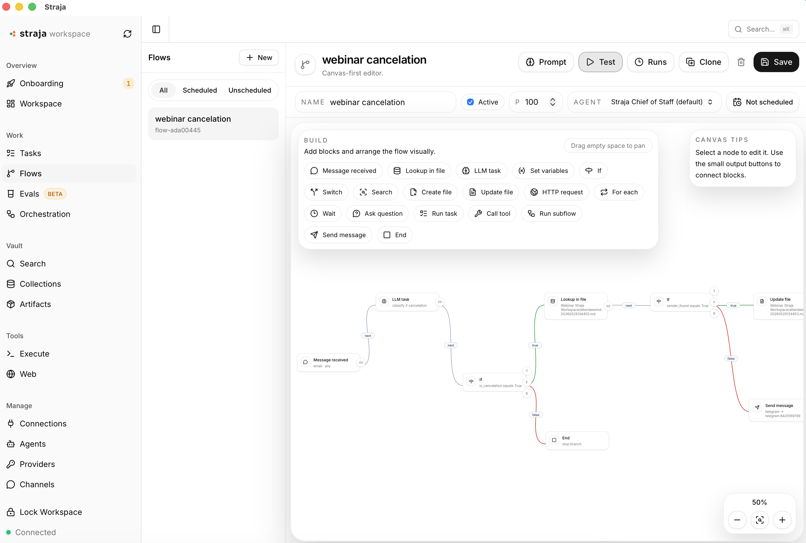
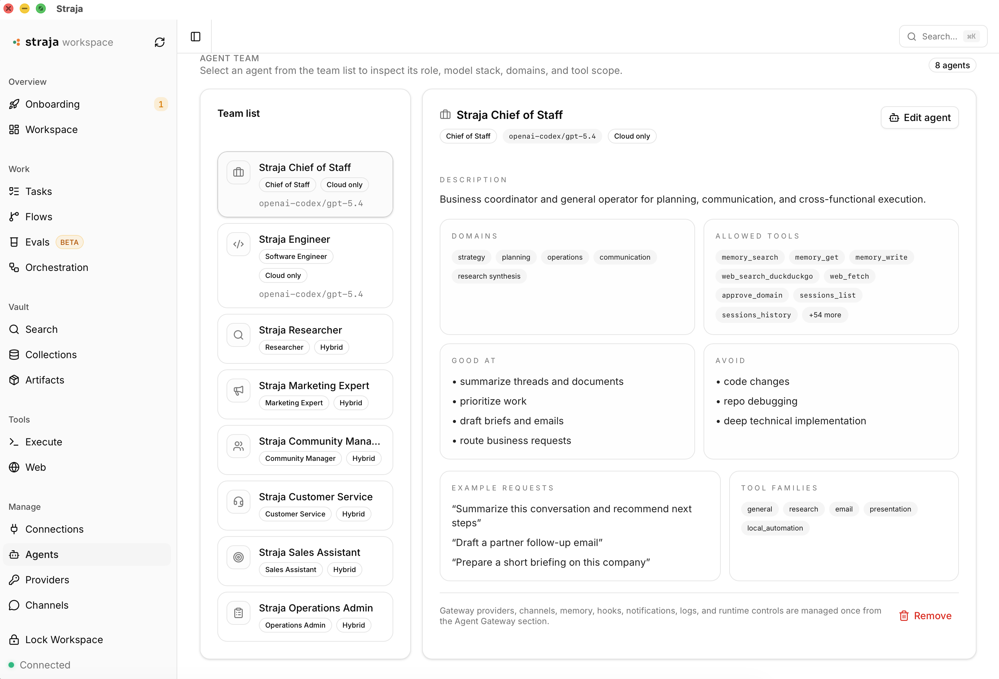

# Straja Workspace

Straja Workspace is a local-first runtime and UI for practical agent work. It combines a workspace UI, agent orchestration, trace storage, deterministic evals, local knowledge retrieval, guarded tool execution, and browser automation into one on-device system.

The project is built for practical agent work rather than abstract demos. A user can run tasks and flows, inspect real traces, evaluate behavior through repeatable suites, search workspace knowledge, connect external systems, and control risk boundaries from one place.

## Workspace Views

### Flows

Build and run visual automations with triggers, branching, agent tasks, Vault lookups, file operations, HTTP requests, and notifications.



### Agents

Configure a team of specialized agents with defined roles, models, domains, and tool access.



## What The Product Includes

Straja Workspace currently ships these main areas:

- `Workspace`: the main home surface for status, quick actions, imports, and recent activity.
- `Tasks`: agent-driven task execution with traceable runs.
- `Flows`: reusable workflow definitions and execution views.
- `Evals`: built-in and custom evaluation suites that run through the normal orchestration path and score traces with deterministic assertions.
- `Orchestration`: trace explorer for routes, prompts, tool calls, outputs, and run artifacts.
- `Vault`: collections, search, artifacts, and retrieval over local content stored in SQLite.
- `Execute`: guarded local command execution with background sessions and output capture.
- `Web`: browser automation through a workspace-owned Playwright MCP boundary with policy enforcement and audit trails.
- `Connections`: external system integrations and runtime connectors.
- `Agents / Providers / Channels / Models`: runtime configuration for the agent layer.
- `Guard / Audit / Usage / Health / Settings`: safety controls, operational visibility, and system configuration.

## Core Product Concepts

### Local-first workspace runtime

Straja Workspace runs on-device and stores its primary state locally. It serves both the web UI and the runtime APIs, and it exposes MCP plus HTTP interfaces for agent control and product features.

### Real orchestration traces

Normal runs create trace data that can be inspected in the Orchestration UI. Traces capture the practical details needed to debug agent behavior: routing decisions, prompts, tool usage, execution steps, outputs, and status.

### Deterministic evals

The eval system is focused on agent and workflow evaluation. An eval case runs through the same orchestration path as a real interaction, records a normal trace, and then applies deterministic assertions against that trace.

Built-in suites in v1:

- `Straja Smoke Suite`
- `Straja Safety Suite`
- `Straja Tool Use Suite`
- `Straja Routing Suite`

Custom suites can be created manually or from existing traces with `Save as eval case` in the trace detail view.

### Guarded tool and browser execution

Straja Workspace owns the boundary around risky execution surfaces. Browser automation is mediated through workspace policy and audit logic, and command execution is handled through the local execution subsystem rather than hidden direct calls.

## Architecture

```text
Straja Workspace UI / Agent Clients / MCP Clients
                    |
             HTTP API + MCP
                    |
           Straja Workspace daemon
                    |
  +------------------------------------------------+
  | Orchestration + trace storage                  |
  | Tasks / flows / eval execution                 |
  | Collections / retrieval / artifacts            |
  | Local exec sessions                            |
  | Browser runtime + policy + audit               |
  | Connectors / agents / provider configuration   |
  +------------------------------------------------+
                    |
                  SQLite
```

The web app talks to the Straja Workspace daemon over HTTP. The daemon also serves MCP and owns persistence, orchestration data, eval storage, and the execution boundaries for tools and browser actions.

## Current UI Surface

The current app routes include:

- `/home`
- `/tasks`
- `/flows`
- `/evals`
- `/evals/suites/:suiteId`
- `/evals/runs/:runId`
- `/orchestration`
- `/orchestration/:traceId`
- `/search`
- `/collections`
- `/artifacts`
- `/exec`
- `/browser`
- `/connections`
- `/agents`
- `/providers`
- `/channels`
- `/models`
- `/guard`
- `/usage`
- `/health`
- `/audit`
- `/settings`

## Evals In v1

The first eval system is intentionally deterministic.

What it supports:

- built-in read-only suites with duplication into custom suites
- persistent storage for suites, cases, runs, and case results
- dry-run execution by default for built-in suites
- suite result summaries with pass/fail/warning/skipped counts
- case-level assertion results with human-readable failure messages
- links from eval results back to normal orchestration traces
- creating an eval case from an existing trace

What it does not support yet:

- LLM-as-judge
- scheduled evals
- CI or CLI eval runners
- complex analytics

## Data And Storage

Straja Workspace uses local storage patterns already established in the app. The system stores content and runtime state in SQLite and keeps orchestration/eval data inside the existing product storage model rather than introducing a separate external service.

Important stored domains include:

- collections and document content
- search and retrieval metadata
- orchestration traces
- eval suites, cases, runs, and results
- browser policy and audit records
- connection and runtime configuration

## Running Locally

### Requirements

- Node.js `>= 22`
- npm

### Install

```bash
npm install
cd web && npm install
```

### Start the backend

```bash
npm run vault -- mcp --http
```

Default backend endpoints:

- UI/API origin: `http://localhost:8181`
- MCP endpoint: `http://localhost:8181/mcp`

### Start the frontend in development

In a second terminal:

```bash
npm run web:dev
```

Then open `http://localhost:5173`.

The Vite dev server proxies API calls to the Straja Workspace daemon on port `8181`.

### Build

```bash
npm run build
npm run web:build
```

After `npm run web:build`, the built frontend can be served by the Straja Workspace daemon on `http://localhost:8181`.

## Testing

Run the backend test suite with:

```bash
npm test
```

To run specific eval-focused tests:

```bash
npx vitest run test/evals-core.test.ts test/evals-http.test.ts
```

## Product Notes

- Built-in eval suites default to `dry_run` so they do not cause production side effects by default.
- Production eval runs require explicit confirmation in the UI.
- Trace-backed evaluation is the intended workflow: run real work, inspect the trace, and promote good examples into reusable cases.
- Browser and tool behavior are designed to be mediated by the workspace runtime rather than bypassing product boundaries.

## License

This project is licensed under the Straja Sustainable Use License in [LICENSE](./LICENSE).

Third-party components remain under their respective original licenses.
